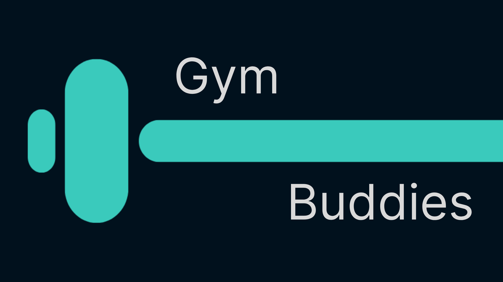

# GymBuddies




[](https://www.gnu.org/licenses/gpl-3.0)

**GymBuddies** is your go-to platform for tracking gym attendance and progress. Whether you're a fitness enthusiast or looking to build consistent habits, GymBuddies provides tools to track sessions, monitor weight goals, and connect with friends.

Features include an interactive heatmap for attendance, weight progress tracking, group competitions, and more—all built for motivating a healthier lifestyle.

---

## 📄 How to Contribute

Contributions are welcome to help grow the fitness community!

### Share Knowledge

* Tips on gym consistency, tracking strategies, and routine advice

### Write Guides

* How-tos on using features, best practices, and social motivation

### Submit Updates

* Fix outdated content, improve UI, or suggest new functionality

### Suggest Features

* Propose improvements and ideas for the community

### Improve Experience

* Refactor logic, enhance UX, or patch bugs. Every bit helps!

---

## 🚀 Getting Started

```bash
# 1. Clone repo
$ git clone https://github.com/your-username/gymbuddies.git

# 2. Install dependencies
$ npm install

# 3. Copy example env file
$ cp example.env.local .env.local

# 4. Start development server
$ npm run dev

# Visit http://localhost:3000
```

---

## 🔐 Environment Setup

```bash
# MongoDB
MONGODB_URI=mongodb+srv://<username>:<password>@cluster.mongodb.net/?retryWrites=true&w=majority&appName=GymBuddies

# Clerk Authentication
NEXT_PUBLIC_CLERK_PUBLISHABLE_KEY=your_clerk_publishable_key
CLERK_SECRET_KEY=your_clerk_secret_key
CLERK_WEBHOOK_SECRET=your_clerk_webhook_secret

# Redirect URLs
NEXT_PUBLIC_CLERK_SIGN_IN_URL=/sign-in
NEXT_PUBLIC_CLERK_SIGN_UP_URL=/sign-up
NEXT_PUBLIC_CLERK_AFTER_SIGN_IN_URL=/dashboard
NEXT_PUBLIC_CLERK_AFTER_SIGN_UP_URL=/dashboard
```

**Note:** Never commit `.env.local` to GitHub. It is listed in `.gitignore`.

---

## 🏢 Project Structure

```
├── app/             # App Router
│   ├── dashboard/
│   ├── profile/
│   └── api/
├── components/      # UI & features
│   ├── dashboard/
│   ├── attendance/
│   ├── profile/
│   └── ui/
├── lib/             # Utility (e.g., MongoDB connection)
├── models/          # Mongoose models
├── public/          # Static assets
```

---

## 🔍 Features

* Personalized user profiles
* Interactive heatmap for gym check-ins
* Weight tracking with charts
* Groups, friends, and leaderboard

---

## ✩️ Contribution Process

```bash
# Create branch
$ git checkout -b feature/my-feature

# Commit using conventional commits
$ git commit -m "feat: added leaderboard component"

# Push and open a PR
```

### Pull Requests

* Use clear titles (feat/fix/docs)
* Describe changes and attach screenshots if UI

### Bug Reports

* Include steps, expected vs actual, environment

### Feature Requests

* Describe the feature, use case, and benefit

---

## ⚧️ Suggested Improvements

<Actions>
  <Action name="Add screenshots to README" description="Add screenshots of key features to make the README more visual" />
  <Action name="Create a CONTRIBUTING.md file" description="Create a separate file with detailed contribution guidelines" />
  <Action name="Add installation troubleshooting" description="Add a section about common installation issues and solutions" />
  <Action name="Create API documentation" description="Document the API endpoints for developers" />
  <Action name="Add deployment instructions" description="Add instructions for deploying to Vercel" />
</Actions>

---

## ✉ License

This project is licensed under the GNU General Public License v3.0.
See the LICENSE file for details.
